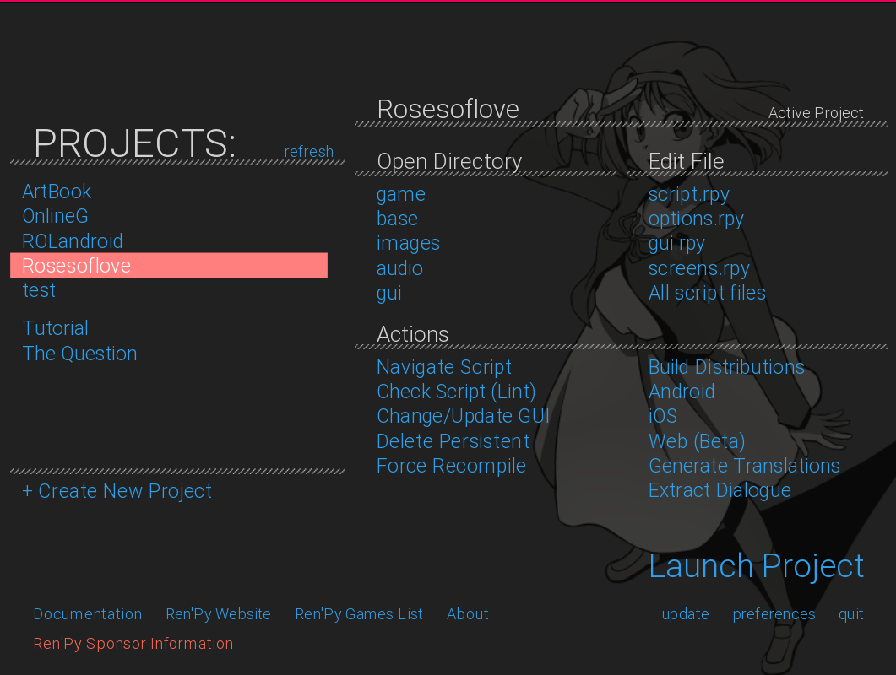
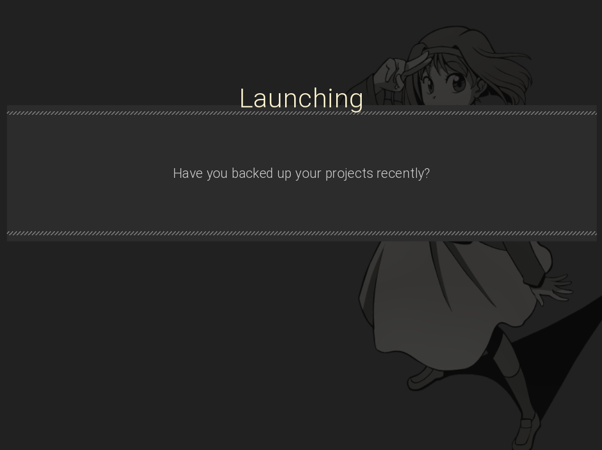
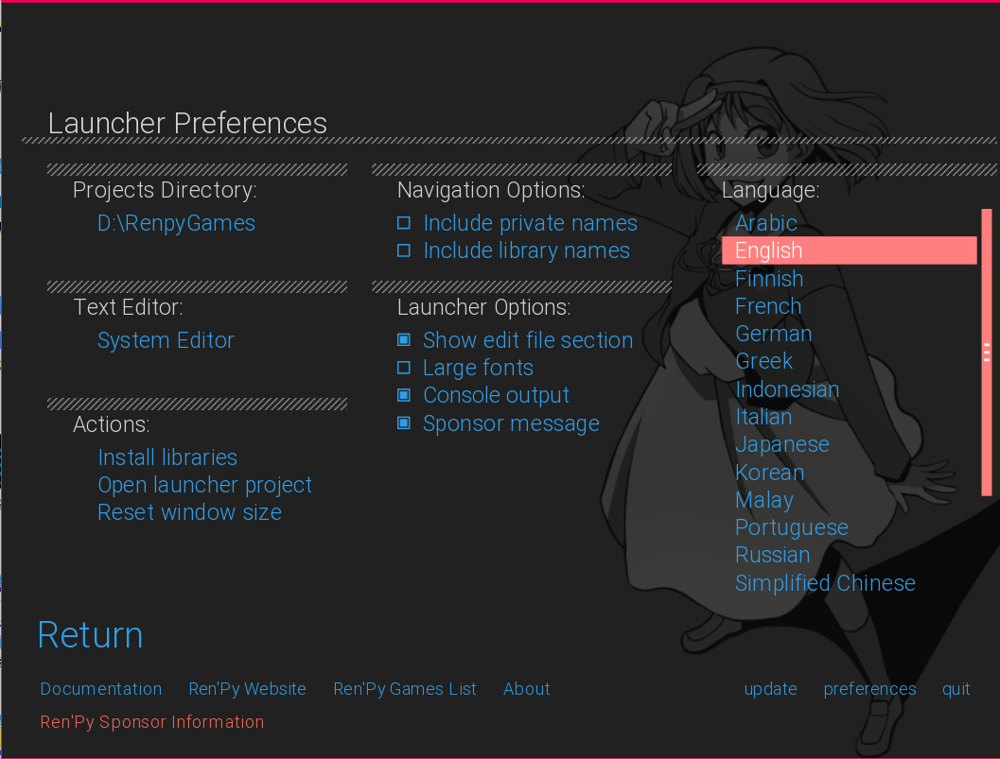

# Ren'Py Dark Theme

### Info

Eileen in the BG credits: To whom the credits are due || https://www.renpy.org/artcard.html

### Preview

How to Install:

1) download the zip file https://github.com/Neyunse/renpy-dark-theme/releases/tag/universal

2) go to Ren'Py path

`C://Program Files/Ren'Py-sdk/launcher/game`

2) descompres the .zip file inside of game folder

3) now open Re'Py

Note: With each new renpy update the theme will continue to be displayed.

To uninstall the dark mode go to `C://Program Files/Ren'Py-sdk/launcher/game` and removes `custom-renpy.rpy` and `custom-renpy.rpyc`

### What does this Theme add? 

1) A dark background with the ren'py mascot and new colors

2) The renpy version and version name are displayed in the window title
